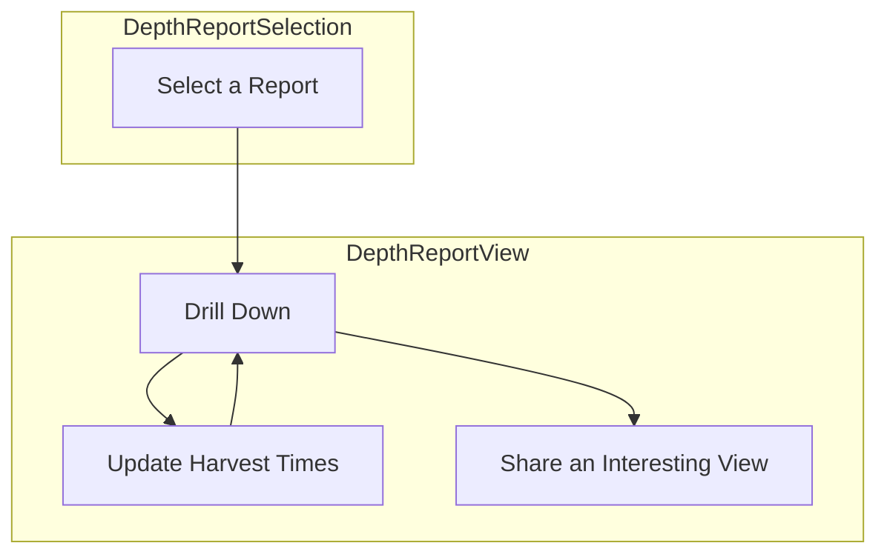

## `DepthOccupancyReport`
`fishflow_app/src/pages/DepthOccupancyReport.jsx`

```jsx
<DepthOccupancyReport
	scenario_id="chinook_2022",
	onNavigate
/>
```

- **@input** - `scenario_id` - the scenario id of the report to display
- **@input** - `onNavigate` - a router function to assist navigation 
#### Notes
- @state `selectedCells` (allow only one cell selection at any time)
- @state `selectedMonths
- @state `selectedHours`

- @state `scenario` scenario metadata object
- @state `geometries` (GeoJson where every polygon has a `cell_id`)
- @state `cell_depths` (maximum depth at each cell)
- @state `timestamps` (full array of timestamps (in order) for this scenario)
- @state `minimums` `{cell_id(int) -> {depth_bin -> {month(int) -> minimums_array}}}` where the minimums array has for each month a hour minimum occupancy over that hour for the month in question (hours are 0-23).
- @state `occupancy_data` `cell_id->occupancy` where `occupancy` is an array of arrays. one array for each model in the mixture with support (same order as `support`) and then the occupancy for each timestamp in `timestamps` for each of those arrays

For further context on the above see `../../Backend/API/Depth/Data.md`

- @state `filtered_occupancy_data` - `occupancy_data` filtered to the selected months
- @state `filtered_timestamps` - `timestamps` filtered to the selected months
- @state `filtered_minimums` `{cell_id->minimum_value}` (minimum over the months and hours currently selected)
- @state `isLoadingGlobal` - boolean indicating whether global data is loading
- @state `isLoadingOccupancy` - boolean indicating whether occupancy data for a cell is loading
- @state `loadError` - string containing error message if data loading fails, or null if no error

##### Use Cases

As a harvester I would like to explore depth occupancy predictions during my harvest windows in order to create a plan of where and when to harvest that minimizes my risk of bycatch. 



- *Why Two Pages?* Once a report is selected there's no reason to take up additional real estate in the view to display the report selector. All we need to indicate is which one has been selected and we're good.
- *Why No Depth Selector?* For our current application net sets happen near the seafloor. Therefore it just adds a layer of complexity that we don't really need.
- *What is a Report?* It is a family of models with support that has been inferred over a specific place and time range. See `../../Reports/Common/Measuring Confidence.md` for more context
- *What is Drill Down?* This means clicking on a specific cell and getting a full timeline of the risk prediction in that cell.
- *How does Sharing Happen?* With a link!
- *What is Actually Viewed?* Minimum risk per cell in the harvest windows chosen. For drilldown the full risk timeline in that cell. 
- *What do the Harvest Times Default Too?* What is not super important but we want some times, a cell, and a harvest window selected so folks can immediately see what is on offer when they pull up the page. 
##### Interactions

- When users change the months selected we should see the minimums on the map change as well as see the graph of guesses filtered to those months.
- When users change the hours selected we should see the minimums on the map change as well as the highlights on the graph of guesses change to match those hours. 
- When users select a cell we should pull up the graph of occupancy inferences (with support) for that cell
- When users first log on the map should render and a default cell should be set as selected and the graph displayed (defaults should be months of Jan-April hours 6am to 6pm (6-18)).
- As the months or hours or selected cell change the url should change too. That way all of this is shareable with someone else. Something like:
	- depth_occupancy/{scenario.id}?months=2,3&hours=1,2,3,4,5,6&cell_id=132
	- React Router should be used for this functionality.
	- *Note*: we need to both debounce these url changes as well as make sure we only update the url params and don't actually cause a rerender (`window.history.replaceState`) so as to not cause the map to keep rerendering every single time we change any filters. 

##### Loading & Error States

**Initial Page Load (`isLoadingGlobal=true`):**
- Display full-page centered spinner while `loadGlobalData` executes
- Spinner should be a simple rotating circle (use CSS animation or a lightweight library)
- No other page content should render until global data loads successfully
- Spinner styling: 50px diameter, `#0d6efd` color, centered vertically and horizontally

**Cell Selection (`isLoadingOccupancy=true`):**
- When user clicks a cell that needs data loading, show a centered spinner in the ContourDateGraph area
- Map and other controls remain interactive
- Spinner appears in place of the graph content with light grey background `#f8f9fa`
- Spinner styling: 40px diameter, `#0d6efd` color

**Error Handling (`loadError` is set):**
- If `loadGlobalData` fails: Display error message with scenario_id and "Retry" button, centered on page
- If `loadOccupancy` fails: Display error message in ContourDateGraph area with "Retry" button
- Error message styling:
  - Background: `#f8d7da` (light red)
  - Border: `1px solid #f5c2c7`
  - Text color: `#842029` (dark red)
  - Padding: `1rem`
  - Border radius: `0.25rem`
  - Font size: `0.875rem`
- Error message format: "Failed to load [data type]. Error: [error message]"
- Retry button styling: Same as TitleBar buttons

**Default Selections:**
- Default months: `[1, 2, 3, 4]` (Jan-Apr)
- Default hours: `[6, 7, 8, 9, 10, 11, 12, 13, 14, 15, 16, 17, 18]` (6am-6pm, hours 6-18)
- Default cell: First cell in the geometries GeoJSON features array (by array order)
- If URL parameters are present and valid, they override defaults
- Invalid URL parameters (out of range, malformed) should be ignored and defaults used instead

##### Build

#### Page Layout

The page should use a CSS Grid layout with the following structure:

```
+--------------------------------------------------+
|                    TitleBar                      |
+--------------------------------------------------+
|                   HourPicker                     |
+--------------------------------------------------+
|              |                        |          |
|              |                        |          |
|   MonthPicker|       CellMap          |          |
|              |                        |          |
|              |                        |          |
+--------------+------------------------+----------+
|              |   ContourDateGraph     |          |
|              |                        |          |
+--------------+------------------------+----------+
```

**Layout Specifications:**
- **TitleBar**: Full width, fixed height
- **HourPicker**: Full width horizontal strip below TitleBar
- **MonthPicker**: Left side vertical strip (fixed width)
- **CellMap**: Center main area, takes majority of vertical space
- **ContourDateGraph**: Full width below map (excluding MonthPicker strip on left)

**CSS Grid Configuration:**
```css
.depth-occupancy-report {
  display: grid;
  grid-template-columns: 200px 1fr;
  grid-template-rows: auto auto 1fr auto;
  height: 100vh;
  width: 100vw;
}

.title-bar {
  grid-column: 1 / -1;
  grid-row: 1;
}

.hour-picker {
  grid-column: 1 / -1;
  grid-row: 2;
}

.month-picker {
  grid-column: 1;
  grid-row: 3 / 5;
}

.cell-map {
  grid-column: 2;
  grid-row: 3;
}

.contour-date-graph {
  grid-column: 2;
  grid-row: 4;
  height: 300px;
}
```

##### Components

`TitleBar`
*Should display the `scenario.name`, that this is a depth occupancy report, and give a button to go back to selection as well as one to just go home.*

`CellMap`

```jsx
<CellMap
  allowMultiSelect={False}
  values={filtered_minimums}
  geojson=geometries
  unit="Minimum Likelihood of Occupancy"
  lowColor="#e8f4f8"
  highColor="#1589b0"
  selectedCells={selectedCells}
  setSelectedCells={setSelectedCells}
  center={scenario.center}
  zoom={scenario.zoom}
  legend_size="medium"
  legend_layout="vertical"
  legend_background="#ffffff"
/>
```

*Visualizes the minimum risk per cell and allows user to select a cell for drill down.*
*Onload it should get zoomed and centered.*
*Legend should show units of minimum occupancy fraction and be horizontal in layout.*

`ContourDateGraph`

```jsx
<ContourDateGraph
  complete_y={filtered_occupancy_data[selectedCells[0]]}
  complete_x={filtered_timestamps}
  highlight_indices={highlight_indices}
  support={scenario.support}
  x_label="Datetime"
  y_label="Likelihood of Occupancy"
  title="Likelihood of Occupancy"
  size="medium"
/>
```

*Shows the various guesses for which we have support for the currently selected cell. Only the months selected should be shown and hours selected will be highlighted with the other hours greyed out.*

*Note: `support` comes from the `scenario` metadata object loaded via `loadGlobalData`. It is an array of support values from the scenario's `MetaDataSchema`, with each element corresponding to a model in the mixture (same ordering as the occupancy data arrays).* 

`MonthPicker`

```jsx
<MonthPicker
  selectedMonths={selectedMonths}
  setSelectedMonths={setSelectedMonths}
  title="Potential Harvest Months"
  size="medium"
  layout="vertical"
  stacks={2}
  justify="top"
/>
```

*Allows folks to select the months they want considered.*
*Right side of the page in a strip*

`HourPicker`

```jsx
<HourPicker
  selectedHours={selectedHours}
  setSelectedHours={setSelectedHours}
  title="Potential Net Set Hours"
  size="medium"
  layout="horizontal"
  stacks={2}
  justify="left"
/>
```

*Allows folks to choose the hours they want considered.*
*Top of the page in a strip*
##### Data Loading

`loadGlobal(scenario_id)`

Occurs on page load

`loadOccupancy(scenario_id, cell_id, cell_depths, occupancy_data)`

Takes place every time a user clicks a new cell (note that if the data for that cell is already present the function does nothing so its safe to call each time)

`filterByMonth(timestamps, selected_months, occupancy_data)`

Called whenever the user changes the months selection

`buildHighlightedIndices(filtered_timestamps, selected_hours)`

Called whenever the selected hours change or when the filtered timestamps change (due to `filterByMonth`)
#### Dependencies

- `../Components/TitleBar.md:TitleBar`
- `../Components/CellMap.md:CellMap`
- `../Components/Pickers.md:HourPicker`
- `../Components/Pickers.md:MonthPicker`
- `../Components/ContourDateGraph.md:ContourDateGraph`
- `loadGlobalData`
- `loadOccupancy`
- `filterByMonth`
- `buildHighlightedIndices`
- `calculateFilteredMinimums`
- `parseUrlParams`
- `updateUrlParams`

## `loadGlobalData`
`fishflow_app/src/pages/DepthOccupancyReport.jsx`

```jsx
loadGlobalData(scenario_id) -> See Below
```

- **@input** `scenario_id` - the id of the scenario to load
- **@returns** `scenario` scenario metadata object
- @state `geometries` (GeoJson where every polygon has a `cell_id`)
- @state `cell_depths` (maximum depth at each cell)
- @state `timestamps` (full array of timestamps (in order) for this scenario)
- @state `minimums` `{cell_id(int) -> depth_bin -> {month(int) -> minimums_array}}}` where the minimums array has for each month a hour minimum occupancy over that hour for the month in question (hours are 0-23). 

For further context on the above see `../../../API/FishFlow/Depth`

#### Notes

Used by `DepthOccupancyReport` to load everything about the report except the occupancy data. 

The `depth_bin` and `month` keys will need to be converted back to `float` and `int` respectively (json will have stringified them and the keys won't match the types we'll be using to index). 

##### Build

Hits the following endpoints (see `../../../API/FishFlow/Depth`)

| Endpoint                                       | Notes                                                                                                |
| ---------------------------------------------- | ---------------------------------------------------------------------------------------------------- |
| `/v1/depth/scenario/{scenario_id}/scenario`    | pass through                                                                                         |
| `/v1/depth/scenario/{scenario_id}/geometries`  | pass through                                                                                         |
| `/v1/depth/scenario/{scenario_id}/cell_depths` | pass through                                                                                         |
| `/v1/depth/scenario/{scenario_id}/timestamps`  | pass through                                                                                         |
| `/v1/depth/scenario/{scenario_id}/minimums`    | filter to the depth bin per cell id as present in `cell_depths` (we only care about the deepest bin) |
Note that the URL should be determined by whether `REACT_APP_FISHFLOW_MODE=DEV` in which case we hit `localhost:8000`, otherwise use `REACT_APP_API_URL`. 

## `loadOccupancy`
`fishflow_app/src/pages/DepthOccupancyReport.jsx`

```jsx
loadOccupancy(scenario_id, cell_id, cell_depths, occupancy_data)
```

- **@input** `scenario_id` - id of the scenario for which we're pulling data
- **@input** `cell_id` - id of the cell we're going to pull occupancy data for
- **@input** `cell_depths` - desired depth bin per cell (used to pull a single depth bin)
- **@input** `occupancy_data` - `{cell_id -> occupancy}`
Updates the `occupancy_data` with this `cell_id`'s `occupancy` if that `cell_id` is not already present. Otherwise just does nothing. 

#### Notes

Used to pull occupancy data as needed by the `DepthOccupancyReport` component.

Hits the `/v1/depth/scenario/{scenario_id}/occupancy?cell_id={cell_id}&depth_bin={depth_bin}` endpoint (see `../../../API/FishFlow/Depth` for more context).

The endpoint returns only the timelines for the specific `cell_id` and `depth_bin` requested. The response is an array of arrays, where:
- Each inner array represents one model's timeline (ordered by `support` from scenario metadata)
- Each timeline contains occupancy values for all timestamps in the scenario
- The array structure is: `[[model0_timeline], [model1_timeline], ..., [modeln_timeline]]`

This should be stored in `occupancy_data[cell_id]` as: `occupancy_data[cell_id] = response_array`

## `filterByMonth`
`fishflow_app/src/pages/DepthOccupancyReport.jsx`

```jsx
filterByMonth(timestamps, selected_months, occupancy_data)
	-> filtered_occupancy_data
	-> filtered_timestamps
```

- **@input** `timestamps` - (full array of timestamps (in order) for a scenario)
- **@input** `selected_months` - an array of months selected (integers)
- **@input** `occupancy_data` - `{cell_id->occupancy}` where `occupancy` is an array of arrays. one array for each model in the mixture with support (same order as `support`) and then the occupancy for each timestamp in `timestamps` for each of those arrays

Filters down to only those timestamps (and corresponding occupancy data) for the months in question. This function filters all cells present in the `occupancy_data` object.

#### Notes

Used by `DepthOccupancyReport` to filter down the occupancy data and timestamps by selected months before plotting. 

## `buildHighlightIndices`
`fishflow_app/src/pages/DepthOccupancyReport.jsx`

```jsx
buildHighlightedIndices(filtered_timestamps, selected_hours)
	-> highlighted_indices
```

- **@input** `filtered_timestamps` - an array of timestamps
- **@input** `selected_hours` - an array of hours (integers 0-23) 
- **@returns** `highlighted_indices` - the indices in the `filtered_timestamps` array that correspond to the hours in the `selectd_hours` array

#### Notes

Used by `DepthOccupancyReport` to determine which indices should be highlighted in the `ContourDateGraph`. 

## `parseUrlParams`
`fishflow_app/src/pages/DepthOccupancyReport.jsx`

```jsx
parseUrlParams(searchParams) -> {months, hours, cell_id}
```

- **@input** `searchParams` - URLSearchParams object from React Router
- **@returns** `months` - Array of month numbers (1-12), or null if not present in URL
- **@returns** `hours` - Array of hour numbers (0-23), or null if not present in URL  
- **@returns** `cell_id` - Cell ID number, or null if not present in URL

#### Notes

Parses URL query parameters on initial page load to restore user's selected state.

Parse the URL parameters:
- `months`: Split comma-separated string, convert to integers
- `hours`: Split comma-separated string, convert to integers
- `cell_id`: Parse as integer

If parameters are missing or malformed, return null for that parameter.

## `updateUrlParams`
`fishflow_app/src/pages/DepthOccupancyReport.jsx`

```jsx
updateUrlParams(navigate, scenario_id, months, hours, cell_id)
```

- **@input** `navigate` - React Router navigate function
- **@input** `scenario_id` - Current scenario ID
- **@input** `months` - Array of selected month numbers (1-12)
- **@input** `hours` - Array of selected hour numbers (0-23)
- **@input** `cell_id` - Selected cell ID

#### Notes

Updates the URL to reflect current user selections without creating a browser history entry.

Build the URL query string:
- `months`: Join array with commas
- `hours`: Join array with commas
- `cell_id`: Convert to string

Use React Router's `navigate` with `replace: true` to update URL without adding to history:

```jsx
navigate(`/depth_occupancy/${scenario_id}?months=${monthsStr}&hours=${hoursStr}&cell_id=${cell_id}`, { replace: true });
```

- Must use `replace: true` to avoid creating history entries
- Should be called immediately when user makes selection changes

## `calculateFilteredMinimums`
`fishflow_app/src/pages/DepthOccupancyReport.jsx`

```jsx
calculateFilteredMinimums(minimums, cell_depths, selectedMonths, selectedHours) 
  -> filtered_minimums
```

- **@input** `minimums` - `{cell_id(int) -> {depth_bin -> {month(int) -> minimums_array}}}` from the API
- **@input** `cell_depths` - `{cell_id(int) -> maximum_depth_bin(float)}` from the API
- **@input** `selectedMonths` - Array of selected month numbers (1-12)
- **@input** `selectedHours` - Array of selected hour numbers (0-23)
- **@returns** `filtered_minimums` - `{cell_id(int) -> minimum_value(float)}` - the minimum occupancy value across all selected months and hours for each cell

#### Notes

Calculates the minimum occupancy value for each cell given the user's selected months and hours. This is used to color the cells on the map.

Algorithm:
1. For each cell_id in minimums:
   - Get the depth_bin for this cell from cell_depths
   - Filter to only that depth_bin in minimums[cell_id] 
   - For each selected month:
     - Get the minimums_array for that month
     - For each selected hour:
       - Collect the minimum value at that hour index
   - Take the minimum across all collected values
   - Store as filtered_minimums[cell_id]

Pseudocode:
```javascript
function calculateFilteredMinimums(minimums, cell_depths, selectedMonths, selectedHours) {
  const filtered_minimums = {};
  
  for (const [cell_id, depth_bins] of Object.entries(minimums)) {
    const depth_bin = cell_depths[cell_id];
    const month_data = depth_bins[depth_bin];
    
    let min_value = Infinity;
    
    for (const month of selectedMonths) {
      const hour_array = month_data[month];
      for (const hour of selectedHours) {
        min_value = Math.min(min_value, hour_array[hour]);
      }
    }
    
    filtered_minimums[cell_id] = min_value;
  }
  
  return filtered_minimums;
}
```

- Should be called whenever selectedMonths or selectedHours changes
- Assumes minimums has already been filtered to only include the relevant depth_bin per cell (as per loadGlobalData)
