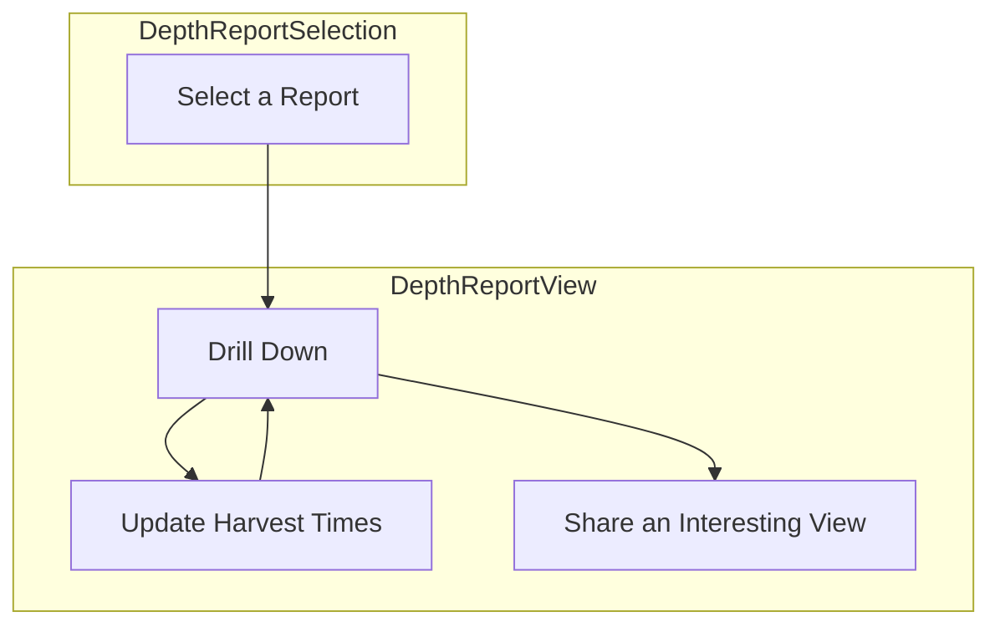

## `DepthOccupancyReport`

### Interfaces

```jsx
<DepthOccupancyReport
	scenario_id="chinook_2022",
	onNavigate
/>
```

- **@input** - `scenario_id` - the scenario id of the report to display
- **input** - `onNavigate` - a router function to assist navigation 
#### States
@state `selectedCells` (allow only one cell selection at any time)
@state `selectedMonths
@state `selectedHours`
#### Data
@state `scenario` scenario metadata object
@state `geometries` (GeoJson where every polygon has a `cell_id`)
@state `cell_depths` (maximum depth at each cell)
@state `timestamps` (full array of timestamps (in order) for this scenario)
@state `minimums` `{cell_id(int) -> {month(int) -> minimums_array}}` where the minimums array has for each month a hour minimum occupancy over that hour for the month in question (hours are 0-23). Note the depth bin has been removed here as we're only ever going to care about the maximum depth recorded in `cell_depths`.
@state `occupancy_data` `cell_id->occupancy` where `occupancy` is an array of arrays. one array for each model in the mixture with support (same order as `support`) and then the occupancy for each timestamp in `timestamps` for each of those arrays

For further context on the above see `../../Backend/API/Depth/Data.md`

@state `filtered_occupancy_data` - `occupancy_data` filtered to the selected months
@state `filtered_timestamps` - `timestamps` filtered to the selected months
@state `filtered_minimums` `{cell_id->minimum_value}` (minimum over the months and hours currently selected)
### Use Cases

As a harvester I would like to explore depth occupancy predictions during my harvest windows in order to create a plan of where and when to harvest that minimizes my risk of bycatch. 



- *Why Two Pages?* Once a report is selected there's no reason to take up additional real estate in the view to display the report selector. All we need to indicate is which one has been selected and we're good.
- *Why No Depth Selector?* For our current application net sets happen near the seafloor. Therefore it just adds a layer of complexity that we don't really need.
- *What is a Report?* It is a family of models with support that has been inferred over a specific place and time range. See `../../Reports/Common/Measuring Confidence.md` for more context
- *What is Drill Down?* This means clicking on a specific cell and getting a full timeline of the risk prediction in that cell.
- *How does Sharing Happen?* With a link!
- *What is Actually Viewed?* Minimum risk per cell in the harvest windows chosen. For drilldown the full risk timeline in that cell. 
- *What do the Harvest Times Default Too?* What is not super important but we want some times, a cell, and a harvest window selected so folks can immediately see what is on offer when they pull up the page. 
#### Interactions

- When users change the months selected we should see the minimums on the map change as well as see the graph of guesses filtered to those months.
- When users change the hours selected we should see the minimums on the map change as well as the highlights on the graph of guesses change to match those hours. 
- When users select a cell we should pull up the graph of occupancy inferences (with support) for that cell
- When users first log on the map should render and a default cell should be set as selected and the graph displayed (defaults should be months of Jan-April hours 6am to 6pm (6-18)).
- As the months or hours or selected cell change the url should change too. That way all of this is shareable with someone else. Something like:
	- depth_occupancy/{scenario.id}?months=2,3&hours=1,2,3,4,5,6&cell_id=132
	- React Router should be used for this functionality.
### Build

`TitleBar`
*Should display the `scenario.name`, that this is a depth occupancy report, and give a button to go back to selection as well as one to just go home.*

`CellMap`

```jsx
<CellMap
  allowMultiSelect={False}
  values={filtered_minimums}
  geojson=geometries
  unit="Minimum Likelihood of Occupancy"
  lowColor="#e8f4f8"
  highColor="#1589b0"
  selectedCells={selectedCells}
  setSelectedCells={setSelectedCells}
  center={scenario.center}
  zoom={scenario.zoom}
  legend_size="medium"
  legend_layout="vertical"
  legend_background="#ffffff"
/>
```

*Visualizes the minimum risk per cell and allows user to select a cell for drill down.*
*Onload it should get zoomed and centered.*
*Legend should show units of minimum occupancy fraction and be horizontal in layout.*

`ContourDateGraph`

```jsx
<LineChart
  complete_y={filtered_occupancy_data[selectedCells[0]]}
  complete_x={filtered_timestamps}
  highlight_indices={highlight_indices}
  support={scenario.support}
  x_label="Datetime"
  y_label="Likelihood of Occupancy"
  title="Likelihood of Occupancy"
  size="medium"
/>
```

*Shows the various guesses for which we have support for the currently selected cell. Only the months selected should be shown and hours selected will be highlighted with the other hours greyed out.* 

`MonthPicker`

```jsx
<MonthPicker
  selectedMonths={selectedMonths}
  setSelectedMonths={setSelectedMonths}
  title="Potential Harvest Months"
  size="medium"
  layout="vertical"
  stacks={2}
  justify="top"
/>
```

*Allows folks to select the months they want considered.*
*Right side of the page in a strip*

`HourPicker`

```jsx
<HourPicker
  selectedHours={selectedHours}
  setSelectedHours={setSelectedHours}
  title="Potential Net Set Hours"
  size="medium"
  layout="horizontal"
  stacks={2}
  justify="left"
/>
```

*Allows folks to choose the hours they want considered.*
*Top of the page in a strip*
#### Data Loading

`loadGlobal(scenario_id)`

Occurs on page load

`loadOccupancy(scenario_id, cell_id, cell_depths, occupancy_data)`

Takes place every time a user clicks a new cell (note that if the data for that cell is already present the function does nothing so its safe to call each time)

`filterByMonth(timestamps, selected_months, occupancy_data)`

Called whenever the user changes the months selection

`buildHighlightedIndices(filtered_timestamps, selected_hours)`

Called whenever the selected hours change or when the filtered timestamps change (due to `filterByMonth`)
#### Dependencies

- `../Components/CellMap.md:CellMap`
- `../Components/Pickers.md:HourPicker`
- `../Components/Pickers.md:MonthPicker`
- `../Components/ContourDateGraph.md:ContourDateGraph`
- `loadGlobalData`
- `loadOccupancy`
- `filterByMonth`
- `buildHighlightedIndices`

#### Placement

```
fishflow
|
+-- frontend
|   |
|   +-- src
|   |   |
|   |   +-- pages
|   |   |   |
|   |   |   +-- DepthOccupancyReport.jsx
```


## `loadGlobalData`

### Interfaces

```jsx
loadGlobalData(scenario_id) -> See Below
```

- **@input** `scenario_id` - the id of the scenario to load
- **@returns** `scenario` scenario metadata object
- @state `geometries` (GeoJson where every polygon has a `cell_id`)
- @state `cell_depths` (maximum depth at each cell)
- @state `timestamps` (full array of timestamps (in order) for this scenario)
- @state `minimums` `{cell_id(int) -> {month(int) -> minimums_array}}` where the minimums array has for each month a hour minimum occupancy over that hour for the month in question (hours are 0-23). Note the depth bin has been removed here as we're only ever going to care about the maximum depth recorded in `cell_depths`.

For further context on the above see `../../Backend/API/Depth/Data.md`

### Use Cases

Used by `DepthOccupancyReport` to load everything about the report except the occupancy data. 

### Build

Hits the following endpoints (see `../../Backend/API/Depth/Depth.md`)

| Endpoint                                       | Notes                                                                                                |
| ---------------------------------------------- | ---------------------------------------------------------------------------------------------------- |
| `/v1/depth/scenario/{scenario_id}/scenario`    | pass through                                                                                         |
| `/v1/depth/scenario/{scenario_id}/geometries`  | pass through                                                                                         |
| `/v1/depth/scenario/{scenario_id}/cell_depths` | pass through                                                                                         |
| `/v1/depth/scenario/{scenario_id}/timestamps`  | pass through                                                                                         |
| `/v1/depth/scenario/{scenario_id}/minimums`    | filter to the depth bin per cell id as present in `cell_depths` (we only care about the deepest bin) |
Note that the URL should be determined by whether the `FishFlowMode=dev` in which case we hit `localhost:3000`. 

#### Placement

```
fishflow
|
+-- frontend
|   |
|   +-- src
|   |   |
|   |   +-- pages
|   |   |   |
|   |   |   +-- DepthOccupancyReport.jsx
```

### Constraints

N/A

## `loadOccupancy`

```jsx
loadOccupancy(scenario_id, cell_id, cell_depths, occupancy_data)
```

- **@input** `scenario_id` - id of the scenario for which we're pulling data
- **@input** `cell_id` - id of the cell we're going to pull occupancy data for
- **@input** `cell_depths` - desired depth bin per cell (used to pull a single depth bin)
- **@input** `occupancy_data` - `{cell_id -> occupancy}`
Updates the `occupancy_data` with this `cell_id`'s `occupancy` if that `cell_id` is not already present. Otherwise just does nothing. 

### Use Cases

Used to pull occupancy data as needed by the `DepthOccupancyReport` component.

### Build

Hits the `/v1/depth/scenario/{scenario_id}/occupancy?cell_id={cell_id}?depth_bin={depth_bin}` endpoint (see `../../Backend/API/Depth/Depth.md` for more context)

### Placement

```
fishflow
|
+-- frontend
|   |
|   +-- src
|   |   |
|   |   +-- pages
|   |   |   |
|   |   |   +-- DepthOccupancyReport.jsx
```

## `filterByMonth`

### Interfaces

```jsx
filterByMonth(timestamps, selected_months, occupancy_data)
	-> filtered_occupancy_data
	-> filtered_timestamps
```

- **@input** `timestamps` - (full array of timestamps (in order) for a scenario)
- **@input** `selected_months` - an array of months selected (integers)
- **@input** `occupancy_data` - `{cell_id->occupancy}` where `occupancy` is an array of arrays. one array for each model in the mixture with support (same order as `support`) and then the occupancy for each timestamp in `timestamps` for each of those arrays

Filters down to only those timestamps (and corresponding occupancy data) for the months in question

### Use Cases 

Used by `DepthOccupancyReport` to filter down the occupancy data and timestamps by selected months before plotting. 

### Build

#### Placement

```
fishflow
|
+-- frontend
|   |
|   +-- src
|   |   |
|   |   +-- pages
|   |   |   |
|   |   |   +-- DepthOccupancyReport.jsx
```

### Constraints

N/A

## `buildHighlightIndices`

### Interfaces

```jsx
buildHighlightedIndices(filtered_timestamps, selected_hours)
	-> highlighted_indices
```

- **@input** `filtered_timestamps` - an array of timestamps
- **@input** `selected_hours` - an array of hours (integers 0-23) 
- **@returns** `highlighted_indices` - the indices in the `filtered_timestamps` array that correspond to the hours in the `selectd_hours` array

### Use Cases 

Used by `DepthOccupancyReport` to determine which indices should be highlighted in the `ContourDateGraph`. 

### Build

#### Placement

```
fishflow
|
+-- frontend
|   |
|   +-- src
|   |   |
|   |   +-- pages
|   |   |   |
|   |   |   +-- DepthOccupancyReport.jsx
```

### Constraints

N/A