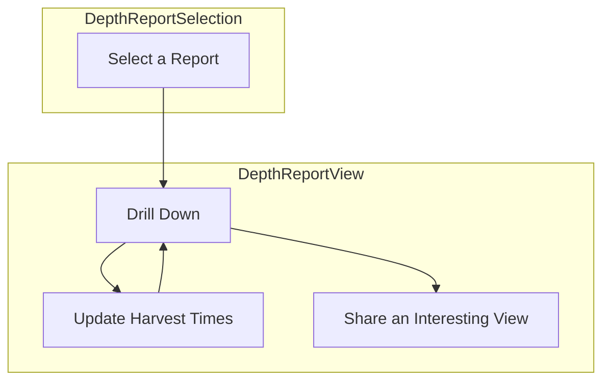

## `DepthOccupancyReport`

### Interfaces

```jsx
<DepthOccupancyReport
	scenario_id="chinook_2022"
/>
```

@input `scenario_id`

#### Current State
@state `selectedCells` (array that only ever has one cell in it)
@state `selectedDates`
@state `selectedHours`
#### Data
@state `scenario` scenario metadata object
@state `geometries` (GeoJson where every polygon has a `cell_id`)
@state `cell_depths` (maximum depth at each cell)
@state `timestamps` (full array of timestamps (in order) for this scenario)
@state `minimums` `cell_id->minimums_map`, `minimums_map={month->minimums_array}` where the minimums array has for each month a hour minimum occupancy over that hour for the month in question (hours are 0-23)
@state `occupancy_data` `cell_id->occupancy` where `occupancy` is an array of arrays. one array for each guess with support (same order as `support`) and then the occupancy for each timestamp in `timestamps` for each of those arrays
@state `filtered_occupancy_data` - `occupancy_data` filtered to the selected months
@state `filtered_timestamps` - `timestamps` filtered to the selected months
@state `filtered_minimums` `{cell_id->minimum_value}` (minimum over the months currently selected)
### Use Cases

As a harvester I would like to explore depth occupancy predictions during my harvest windows in order to create a plan of where and when to harvest that minimizes my risk of bycatch. 



- *Why Two Pages?* Once a report is selected there's no reason to take up additional real estate in the view to display the report selector. All we need to indicate is which one has been selected and we're good.
- *Why No Depth Selector?* For our current application net sets happen near the seafloor. Therefore it just adds a layer of complexity that we don't really need.
- *What is a Report?* It is a family of models with support that has been inferred over a specific place and time range.
- *What is Drill Down?* This means clicking on a specific cell and getting a full timeline of the risk prediction in that cell.
- *How does Sharing Happen?* With a link!
- *What is Actually Viewed?* Minimum risk per cell in the harvest windows chosen. For drilldown the full risk timeline in that cell. 
- *What do the Harvest Times Default Too?* What is not super important but we want some times, a cell, and a harvest window selected so folks can immediately see what is on offer when they pull up the page. 
### Interactions

- When users change the months selected we should see the minimums on the map change as well as see the graph of guesses filtered to those months.
- When users change the hours selected we should see the minimums on the map change as well as the highlights on the graph of guesses change to match those hours. 
- When users select a cell we should pull up the graph of occupancy guesses (with support) for that cell
- When users first log on the map should render and a default cell should be set as selected and the graph displayed (defaults should be months of Jan-April hours 6am to 6pm (6-18)).
- As the months or hours or selected cell change the url should change too. That way all of this is shareable with someone else. Something like:
	- depth_occupancy/{scenario.id}?months=2,3&hours=1,2,3,4,5,6&cell_id=132
	- React Router should be used for this functionality.
### Build

`TitleBar`
*Should display the `scenario.name`, that this is a depth occupancy report, and give a button to go back to selection as well as one to just go home.*

`CellMap`

```jsx
<CellMap
  allowMultiSelect={False}
  values={filtered_minimums}
  geojson=geometries
  unit="Minimum Likelihood of Occupancy"
  lowColor="#e8f4f8"
  highColor="#1589b0"
  selectedCells={selectedCells}
  setSelectedCells={setSelectedCells}
  center={scenario.center}
  zoom={scenario.zoom}
  legend_size="medium"
  legend_layout="vertical"
  legend_background="#ffffff"
/>
```

*Visualizes the minimum risk per cell and allows user to select a cell for drill down.*
*Onload it should get zoomed and centered.*
*Legend should show units of minimum occupancy fraction and be horizontal in layout.*

`ContourDateGraph`

```jsx
<LineChart
  complete_y={filtered_occupancy_data[selectedCells[0]]}
  complete_x={filtered_timestamps}
  highlight_indices={highlight_indices}
  support={scenario.support}
  x_label="Datetime"
  y_label="Likelihood of Occupancy"
  title="Likelihood of Occupancy"
  size="medium"
/>
```

*Shows the various guesses for which we have support for the currently selected cell. Only the months selected should be shown and hours selected will be highlighted with the other hours greyed out.* 

`MonthPicker`

```jsx
<MonthPicker
  selectedMonths={selectedMonths}
  setSelectedMonths={setSelectedMonths}
  title="Potential Harvest Months"
  size="medium"
  layout="vertical"
  stacks={2}
  justify="top"
/>
```

*Allows folks to select the months they want considered.*
*Right side of the page in a strip*

`HourPicker`

```jsx
<HourPicker
  selectedHours={selectedHours}
  setSelectedHours={setSelectedHours}
  title="Potential Net Set Hours"
  size="medium"
  layout="horizontal"
  stacks={2}
  justify="left"
/>
```

*Allows folks to choose the hours they want considered.*
*Top of the page in a strip*
#### Data Loading

`loadGlobal`
	@state scenario
	@affects geometries
	@affects cell_depths
	@affects timestamps
	@affects minimums

Occurs on page load

/depth2/scenario/{scenario_id}/geometries
/depth2/scenario/{scenario_id}/cell_depths
/depth2/scenario/{scenario_id}/timestamps
/depth2/scenario/{scenario_id}/minimums

`loadOccupancy`
Occurs whenever someone clicks a new cell on the map
	@input cell_id
	@input cell_depths
	@affects occupancy_map
	@returns occupancy for the cell_id in question
Looks in the occupancy_map to see if the cell_id is already there, if not calls: 
/depth2/scenario/{scenario_id}/occupancy?cell_id={cell_id}&depth_bin={cell_depths\[cell_id]}
and adds the data to the occupancy_map.

#### Transformations

`extractMinimums`
	@input minimum from /depth2/scenario/{scenario_id}/minimums
	@input `cell_depths`
	@returns `{cell_id -> {month: [minimums of likelihood of occupancy per hour of day (0-23)}`
Extracts the minimums at the maximum depth specified by `cell_depths` from the minimums from /depth2/scenario/{scenario_id}/minimums

`pullScenario`
Hits the API endpoint for pulling scenario data and places it in `scenario`

`filterByMonth`
	@input `timestamps`
	@input `occupancy_data`
	@input `selectedMonths`
	@returns `filtered_occupancy_data`
	@returns `filtered_timestamps`
Filters down to only those timestamps (and corresponding occupancy data) for the months in question

`buildHighlightIndices`
	@input `filtered_timestamps`
	@input `selectedHours`
	@returns `highlight_indices` - the indices in `filtered_timestamps` that correspond to the `selectedHours`
#### Effects

`filterOccupancyData`
	@trigger `selectedMonths`
	@trigger `selectedHours`
	@affects `highlight_indices`
	@affects `filtered_occupancy_data`
	@affects `filtered_timestamps`

Calls `filterByMonth` and then `buildHighlightIndices`

`getMinimums`
	@trigger `minimums`
	@trigger `selectedMonths`
	@trigger `selectedHours`
	@affects `filtered_minimums` `{cell_id->minimum_value}`
Takes the minimum for each `cell_id` over the months and hours currently selected

See `loadOccupancyData`

#### Dependencies

- `CellMap`
- `HourPicker`
- `MonthPicker`
- `ContourDateGraph`

#### Placement

```
fishflow
|
+-- frontend
|   |
|   +-- src
|   |   |
|   |   +-- pages
|   |   |   |
|   |   |   +-- DepthOccupancyReport.jsx
```


