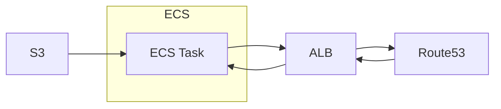
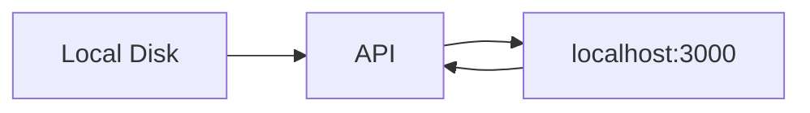
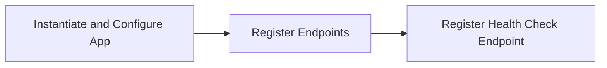

## `FishFlow API`

### Interfaces

`v1/depth` (See `Depth/`)

### Use Cases

A `FastAPI` application that serves data from behavioral models for the `FishFlow` App.

### Build

The API itself uses the `register_endpoint_spec` function for each `ENDPOINT_SPEC` defined in Interfaces above. This allows us to move all of the code defining each endpoint "class" into its own section and have the actual app code simply be the instantiation of the app and registering of the endpoints.

There is a `FishFlowData` environment variable that points to the directory (or bucket and directory) where the data for the API is stored. 
#### Deployment

**Note: Infrastructure deployment is deferred for later implementation. The information below is for context only.**



Data is held in S3 under specific schemas (see `Data.md` in each of the endpoint directories). The API is loaded up in ECS and placed behind an ALB which itself is behind Route53 (see `Infra/`)

All deployment is done using docker and cloudformation templates. 

#### Local Development


Disk replaces S3 in this scenario. Local development is toggled by setting the environment variable `FishFlowMode=dev`

#### Dependencies

- `Infra/`
- `Depth/`
- `main`
- `register_endpoints_spec`

#### Placement

`fishflow/backend/api`

This is just context on how all the pieces fit together. 

## `main`

### Interfaces

```bash
uvicorn app.main:app --reload --host 0.0.0.0 --port 3000
```

### Use Cases

Bundles the `FastAPI` app so we can run it!

### Build



Endpoints should be registered using the `register_endpoint_spec` function and the `ENDPOINT_SPEC` in:

- `Depth/`

The health check endpoint should be a simple GET endpoint at `/health` that returns a 200 status code with `{"status": "healthy"}` to indicate the API is running.

#### Placement

```bash
fishflow
|
+-- backend
|   |
|   +-- api
|   |   |
|   |   +-- app
|   |   |   |
|   |   |   +-- main.py <--
```

### Constraints

We need to be able to service the following roots

```
http://localhost:3000
https://networkearth.io
https://www.networkearth.io
```

with the first being for development and the others for production.

## `register_endpoint_spec`

### Interfaces

```python
register_endpoint_spec(app, endpoint_spec)
```

- **@input** `app` (`FastAPI` app) - the app we'll be registering endpoints on
- **@input** `endpoint_spec` (dict) - endpoint -> (handler function, response_model)
### Use Cases

Given a `endpoint_spec`

```python
{
	"/v1/endpoint1": (endpoint_1, response_model1),
	"/v1/endpoint2/{param}": (endpoint_2, response_model2),
}
```

registers the endpoint functions and response models with a `FastAPI` `app` as GET endpoints. All endpoints should be registered as GET requests with a 200 status code on success. 

### Build

```bash
fishflow
|
+-- backend
|   |
|   +-- api
|   |   |
|   |   +-- app
|   |   |   |
|   |   |   +-- main.py <--
```

### Constraints

N/A

