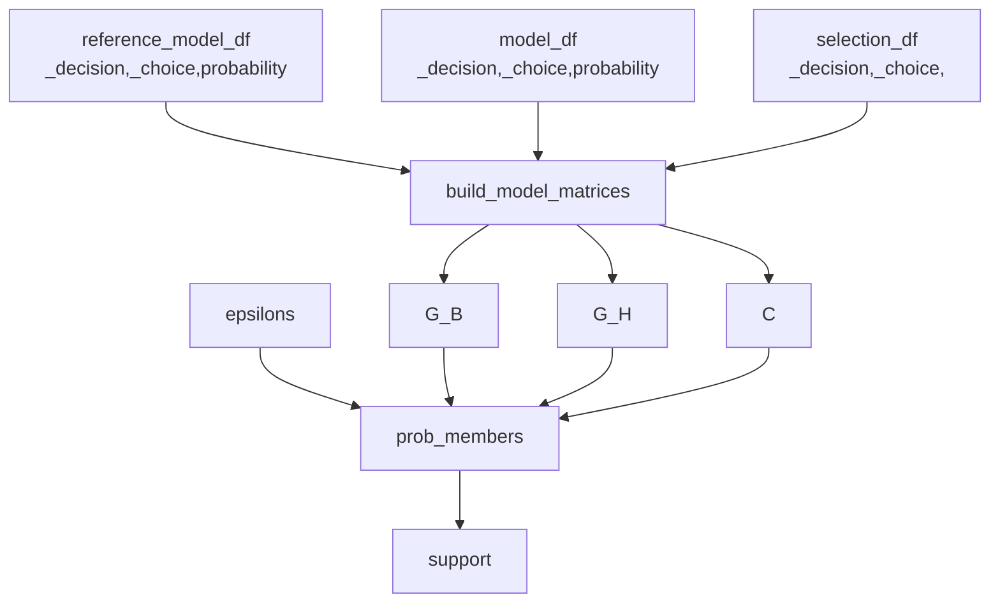

## `build_model_matrices`

For context on the matrices we are referring to please see `Computing Model Likelihood.md`
### Interfaces 

```python
build_model_matrices(model_df, reference_model_df, selections_df)
    --> model_matrix, reference_model_matrix, selection_matrix
```

- **@input** `model_df` - dataframe with columns `_decision`, `_choice`, `probability` giving the modeled probabilities for each choice across each decision for the non-reference model.
- **@input** `reference_model_df` - dataframe with columns `_decision`, `_choice`, `probability` giving the modeled probabilities for each choice across each decision for the reference model.
- **@input** `selection_df` - dataframe with columns `_decision`, `_choice`. Only those choices that were actually selected in the observed data are present in this dataframe. That means there is a single `_choice` per `_decision` here wherease the `model_df` and `reference_model_df` have multiple choices per decision.
- **@returns** `model_matrix` - $G_H$ from `Computing Model Likelihood.md`
- **@returns** `reference_model_matrix` - $G_B$ from `Computing Model Likelihood.md`
- **@returns** `selection_matrix` - $C$ from `Computing Model Likelihood.md`

### Use Cases

Allows us to transform a series of dataframes into the matrices needed by the support building functions. 
### Build

#### Placement

```bash
fishflow
|
+-- reports
|   |
|   +-- fishflow
|   |   |
|   |   +-- common
|   |   |   |
|   |   |   +-- support.py <--
```

### Constraints

See `Computing Model Likelihood.md`

## `compute_support`

See `Measuring Confidence.md` for more context.

### Interfaces

```python
compute_support(model_df, reference_model_df, selections_df, epsilons)
    --> support
```

- **@input** `model_df` - dataframe with columns `_decision`, `_choice`, `probability` giving the modeled probabilities for each choice across each decision for the non-reference model.
- **@input** `reference_model_df` - dataframe with columns `_decision`, `_choice`, `probability` giving the modeled probabilities for each choice across each decision for the reference model.
- **@input** `selection_df` - dataframe with columns `_decision`, `_choice`. Only those choices that were actually selected in the observed data are present in this dataframe. That means there is a single `_choice` per `_decision` here wherease the `model_df` and `reference_model_df` have multiple choices per decision.
- **@input** `epsilons` - an array of floats from 0 to 1 (inclusive) that determines the density of our model mixture (see `Measuring Confidence.md`)
- **@returns** `support` - an array of likelihoods for each model in our mixture (same order as the `epsilons`)

### Use Cases

Wrapper to compute support for a model mixture quickly and easily from a set of dataframes. 

### Computing Support



#### Dependencies

- `Computing Model Likelihood:prob_members`
- `build_model_matrices`

#### Placement

```bash
fishflow
|
+-- reports
|   |
|   +-- fishflow
|   |   |
|   |   +-- common
|   |   |   |
|   |   |   +-- support.py <--
```

### Constraints

N/A

## `compute_mixtures`

### Interfaces 

```python
compute_mixtures(model_df, reference_model_df, epsilons)
-> mixtures_df
```

- **@input** `model_df` - dataframe with columns `_decision`, `_choice`, `probability` giving the modeled probabilities for each choice across each decision for the non-reference model.
- **@input** `reference_model_df` - dataframe with columns `_decision`, `_choice`, `probability` giving the modeled probabilities for each choice across each decision for the reference model.
- **@input** `epsilons` - an array of floats from 0 to 1 (inclusive) that determines the density of our model mixture (see `Measuring Confidence.md`)
- **@returns** `mixtures_df` - a dataframe with columns `_decision`, `_choice`, `epsilon`, `probability` and rows for every model in our mixture across all decisions in the original dataframes. 
### Use Cases

Mixes the models predictions!
### Build

#### Placement

```bash
fishflow
|
+-- reports
|   |
|   +-- fishflow
|   |   |
|   |   +-- common
|   |   |   |
|   |   |   +-- support.py <--
```

### Constraints

Should apply the following logic takes the following steps:

1. Join reference model with the model to get both probabilities in the same dataframe. 
2. Cross join with the `epsilons` to get a copy of the dataframe for each $\epsilon$
3. Compute the odds of each row as $G_H\epsilon+(1-\epsilon)G_B$ where $G_B$ corresponds to the probability of the reference guess and $G_H$ to the normal guess. 
4. Get the sum of odds across all choices in a decision for each epsilon (group by `_choice`, `_decision`, `epsilon`) 
5. Compute the probability for the specific mixture as odds/sum odds. 

Should keep all other columns in the input dataframe (any context)
