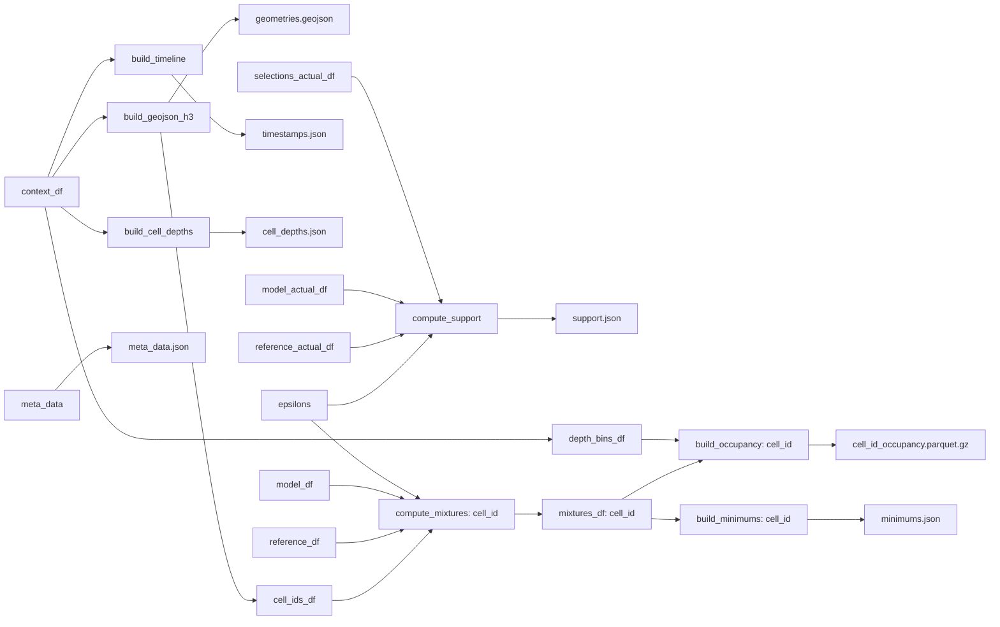

## `build_report`

### Interfaces

```python
build_report(
	meta_data,
	model_df, 
	reference_model_df,
	context_df,
	model_actuals_df,
	reference_model_actuals_df,
	selections_actuals_df,
	epsilons,
	data_dir
)
```

- **@input** `meta_data` - the metadata for this scenario (see `../../../Backend/API/Depth/Data.md:MetaDataSchema)
- **@input** `model_df` - inference of our model over the space and time of interest (`_decision`, `_choice`, `probability`) (mixtures are built from this)
- **@input** `reference_model_df` - inference of our model over the space and time of interest (`_decision`, `_choice`, `probability`) (mixtures are built from this)
- **@input** `context_df` - the context associated with our choices `_decision`, `_choice`, `datetime`, `h3_index`, `depth_bin`
- **@input** `model_actuals_df` - inference of our model over the space and time we want to derive our support from (`_decision`, `_choice`, `probability`) 
- **@input** `reference_model_actuals_df` - inference of our model over the space and time we want to derive our support from (`_decision`, `_choice`, `probability`)
- **@input** `selections_actuals_df` -  the `_decision`, `_choice` pairs actually observed (one choice per decision here)
- **@input** `epsilons` - an array from 0 to 1 indicating the mixture family density we want
- **@input** `data_dir` - the directory to build our `{scenario_id}` directory in and place the following files:

```bash
+-- {scenario_id}
|   | 
|   +-- meta_data.json
|   +-- geometries.geojson
|   +-- cell_depths.json
|   +-- minimums.json
|   +-- timestamps.json
|   +-- {cell_id}_occupancy.parquet.gz
```

(documented in `../../Backend/API/Depth/Data.md`)
### Use Cases 

The purpose of the `build_report` is to fill out the following schema (documented in `../../Backend/API/Depth/Data.md`): 

```bash
+-- {scenario_id}
|   | 
|   +-- meta_data.json
|   +-- geometries.geojson
|   +-- cell_depths.json
|   +-- minimums.json
|   +-- timestamps.json
|   +-- {cell_id}_occupancy.parquet.gz
```

for the inference of a model mixture of two depth models over a specific time and place. For more on what a model mixture is see `../Common/Measuring Confidence.md`

### Build

Building a mixture is a bit of a web... 


#### Dependencies

- `../Common/Support.md:compute_support`
- `../Common/Support.md:compute_mixtures`
- `../Common/Spacetime.md:build_geojson`
- `../CommonSpacetime.md:build_timeline`
- `build_minimums`
- `build_occupancy`
- `build_cell_depths`
- 
#### Placement

```bash
fishflow
|
+-- reports
|   |
|   +-- fishflow
|   |   |
|   |   +-- depth
|   |   |   |
|   |   |   +-- report.py <--
```

### Constraints

Given there's going to be a _ton_ of data here we want to build mixtures one cell at a time. 

## `build_minimums`

### Interfaces

```python
build_minimums(mixture_df, minimums={}) --> minimums
```

- **@input** `mixture_df` - `cell_id`, `depth_bin`, `datetime`, `probability`
- **@input** `minimums` - `minimums` to add to
- **@returns** an updated `minimums`
### Use Cases

Creates a minimums map as documented in `../../Backend/API/Depth/Data.md:MinimumsSchema`
### Build

We need to break the timestamp into a month of the year (0-12) and hour of the day (0-23). Then we bin by `cell_id`, `depth_bin`, month of the year, hour of the day, and take the minimum over `probability` per bin. 
#### Placement

```bash
fishflow
|
+-- reports
|   |
|   +-- fishflow
|   |   |
|   |   +-- depth
|   |   |   |
|   |   |   +-- report.py <--
```

### Constraints

## `build_occupancy`

### Interfaces

```python
build_occupancy(mixture_df) --> occupancy_df
```

- **@input** `mixture_df` - mixture dataframe for a single `cell_id` with at least the columns `depth_bin`, `datetime`, `probability`, `epsilon` 
- **@returns** `occupancy_df` - a dataframe where the columns represent combinations of depth bin and mixture model (captured by `epsilon`), the rows are the `datetime` in order (earliest at top), and the values are the corresponding `probability`'s

For the columns we have `model_idx=col // num_depth_bins` and `depth_bin_idx=col % num_depth_bins`. `model_idx` is the index in the sorted `epsilon` array built of the unique `epsilon`'s in `mixture_df`.

For more context see `../../Backend/API/Depth/Data.md:OccupancySchema`
### Use Cases

Builds an occupancy dataframe for a specific `cell_id`
### Build
#### Placement

```bash
fishflow
|
+-- reports
|   |
|   +-- fishflow
|   |   |
|   |   +-- depth
|   |   |   |
|   |   |   +-- report.py <--
```

### Constraints

N/A

## `build_cell_depths`

### Interfaces

```python
build_cell_depths(context_df) --> cell_depths
```

- **@input** `context_df` - a dataframe with at least `cell_id`, `depth_bin`
- **@returns** `cell_depths` - `{cell_id: max(cell_depth)}`

### Use Cases

Gets the deepest depth bin per `cell_id`

### Build
#### Placement

```bash
fishflow
|
+-- reports
|   |
|   +-- fishflow
|   |   |
|   |   +-- depth
|   |   |   |
|   |   |   +-- report.py <--
```

### Constraints

N/A


