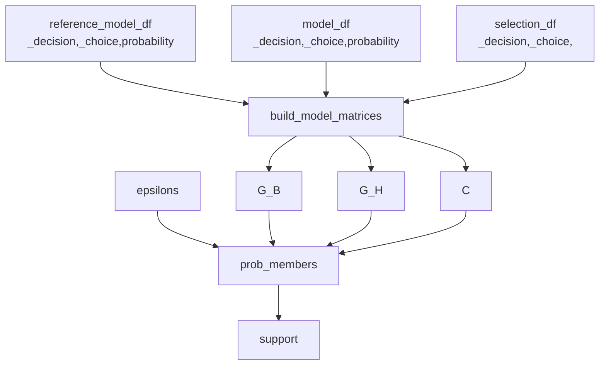

## Context
For additional context see `Bayesian Model Interpolation.md`.

- $D$: a dataset of choices and decisions 
- $N_D$: the number of decisions in the dataset $D$
- $N_C$: maximum number of choices across all decisions in $D$
- *Model* - a model we are trying to evaluate
- *Reference Model* - a trusted reference model we're going to use to evaluate our confidence in the *model*. (See `Bayesian Model Interpolation.md`)
## `log_likelihood_member`
`fishflow/common/support.py`

```python
log_likelihood_member(
	epsilon, reference_model_matrix, model_matrix, selections_matrix
) --> log_likelihood
```
#### Inputs
- `epsilon` - `float` a number ranging between 0 and 1 ($\epsilon$)
- `reference_model_matrix` - `np.ndarray` ($N_D$ x $N_C$) with the with the probabilities for each choice in each decision for the reference model ($G_B$)
-  `model_matrix` - `np.ndarray` ($N_D$ x $N_C$) with the with the probabilities for each choice in each decision for the model ($G_H$)
- `selections_matrix` - binary `np.ndarray` ($N_D$ x $N_C$) indicating which choice was selected for each decision. That is the sum of each row is exactly. ($C$)
#### Outputs
- Log likelihood of the data $D$ given the distribution family member defined by $G_B$, $G_H$, and $\epsilon$. 
#### Notes
First we'll compute the odds given by this member of the distribution family: 

$$O=\epsilon G_H+(1-\epsilon)G_B$$
and the $G_{\epsilon_k}$ given by:

$$G_{\epsilon}=\frac{o_{ij}}{\sum_{j} o_{ij}}$$
where $o_{ij}$ represents each element of $O$. I.e., we are dividing each element by its row sum to produce a probability. 

From this the likelihood of each datapoint is:

$$P(D_i | \epsilon)=\sum_{row}G_{\epsilon}\bullet C$$
where the $\bullet$ indicates element wise multiplication. (We are only pulling the probabilities associated with the choices that were actually made) This will result in a single column with a probability for each decision's choice given $G_{\epsilon}$. 

We can then get the log likelihood of the data given the guess $G_{\epsilon}$ as:

$$\sum_i \log{P(D_i| \epsilon)}$$
## `prob_members`
`fishflow/common/support.py`

```python
prob_members(
	reference_model_matrix,
	model_matrix,
	selections_matrix,
	epsilons,
	prior_probs=None
) --> likelihoods
```
#### Inputs
- `reference_model_matrix` - `np.ndarray` ($N_D$ x $N_C$) with the with the probabilities for each choice in each decision for the reference model ($G_B$)
-  `model_matrix` - `np.ndarray` ($N_D$ x $N_C$) with the with the probabilities for each choice in each decision for the model ($G_H$)
- `selections_matrix` - binary `np.ndarray` ($N_D$ x $N_C$) indicating which choice was selected for each decision. That is the sum of each row is exactly. ($C$)
- `epsilon` - `np.ndarray` an ordered (low to high) array of floats number ranging between 0 and 1 inclusive ($E$).  Each member of the family is defined by one of these $\epsilon_i$.
- `prior_probs` - optional `np.ndarray` of prior likelihoods for each $\epsilon_i$. Defaults to even likelihood for all $\epsilon_i$. 
#### Outputs
- `likelihoods` - `np.ndarray` of $P(\epsilon_i | D)$: the likelihood of the guess defined by $\epsilon_i$ given the data $D$ and prior $P(\epsilon_i)$ 
#### Notes
This function efficiently computes the likelihood of each model given some dataset $D$ in the family of models spanned by a model and its reference model. 

If $\epsilon_k$ is the minimum $\epsilon_i \in E$ then compute:

$$L_k=\log{P(\epsilon_0)}+\sum_j \log{P(D_j| \epsilon_k)}$$
using `log_likelihood_member`. Now for each other $\epsilon_i$ compute:

$$L_i=\log{P(\epsilon_i)}+\sum_j \log{P(D_j| \epsilon_i)}$$
Then we can compute:

$$r_i=e^{L_i - L_k}$$
Note that this corresponds to:

$$r_i=\frac{P(\epsilon_i)\prod_j P(D_j| \epsilon_i)}{P(\epsilon_k)\prod_j P(D_j| \epsilon_k)}$$
but by using the logarithms it is numerically stable. This ratio is equal to the ratio of $P(\epsilon_i |D)/P(\epsilon_k|D)$ in the posterior distribution. Therefore we can compute:

$$P(\epsilon_i|D)=\frac{r_i}{\sum_j r_j}$$
and return our result!

## `build_model_matrices`
`fishflow/common/support.py`

```python
build_model_matrices(model_df, reference_model_df, selections_df)
    --> model_matrix, reference_model_matrix, selection_matrix
```
#### Inputs
- `model_df` - `pd.DataFrame` with columns `_decision`, `_choice`, `probability` giving the modeled probabilities for each choice across each decision for the non-reference model.
- `reference_model_df` - `pd.DataFrame` with columns `_decision`, `_choice`, `probability` giving the modeled probabilities for each choice across each decision for the reference model.
- `selection_df` - `pd.DataFrame` with columns `_decision`, `_choice`. Only those choices that were actually selected in the observed data are present in this dataframe. That means there is a single `_choice` per `_decision` here wherease the `model_df` and `reference_model_df` have multiple choices per decision.
#### Outputs
- `model_matrix` - $G_H$ for `prob_members`
- `reference_model_matrix` - $G_B$ from `prob_members`
- `selection_matrix` - $C$ from `prob_members`

## `compute_support`
`fishflow/common/support.py`

```python
compute_support(model_df, reference_model_df, selections_df, epsilons)
    --> support
```
#### Inputs
- `model_df` - `pd.DataFrame` with columns `_decision`, `_choice`, `probability` giving the modeled probabilities for each choice across each decision for the non-reference model.
- `reference_model_df` - `pd.DataFrame` with columns `_decision`, `_choice`, `probability` giving the modeled probabilities for each choice across each decision for the reference model.
- `selection_df` - `pd.DataFrame` with columns `_decision`, `_choice`. Only those choices that were actually selected in the observed data are present in this dataframe. That means there is a single `_choice` per `_decision` here wherease the `model_df` and `reference_model_df` have multiple choices per decision.
- `epsilons` - an `np.ndarray` of floats from 0 to 1 (inclusive) that determines the density of our model mixture (see `Measuring Confidence.md`)
#### Outputs
- `support` - an array of likelihoods for each model in our mixture (same order as the `epsilons`)
#### Notes

This is a wrapper to compute support for a model mixture quickly and easily from a set of dataframes. 



#### Dependencies

- `prob_members`
- `build_model_matrices`

## `compute_mixtures`
`fishflow/common/support.py`

```python
compute_mixtures(model_df, reference_model_df, epsilons)
-> mixtures_df
```
#### Inputs
- `model_df` - `pd.DataFrame` with columns `_decision`, `_choice`, `probability` giving the modeled probabilities for each choice across each decision for the non-reference model.
- `reference_model_df` - `pd.DataFrame` with columns `_decision`, `_choice`, `probability` giving the modeled probabilities for each choice across each decision for the reference model.
- `epsilons` - an `np.ndarray` of floats from 0 to 1 (inclusive) that determines the density of our model mixture (see `Bayesian Model Interpolation.md`)
#### Outputs
- `mixtures_df` - a `pd.DataFrame` with columns `_decision`, `_choice`, `epsilon`, `probability` and rows for every model in our mixture across all decisions in the original dataframes. 
#### Notes

Should apply the following logic takes the following steps:

1. Join reference model with the model to get both probabilities in the same dataframe. 
2. Cross join with the `epsilons` to get a copy of the dataframe for each $\epsilon$
3. Compute the odds of each row as $G_H\epsilon+(1-\epsilon)G_B$ where $G_B$ corresponds to the probability of the reference guess and $G_H$ to the normal guess. 
4. Get the sum of odds across all choices in a decision for each epsilon (group by `_choice`, `_decision`, `epsilon`) 
5. Compute the probability for the specific mixture as odds/sum odds. 

Should keep all other columns in the input dataframe (any context)
