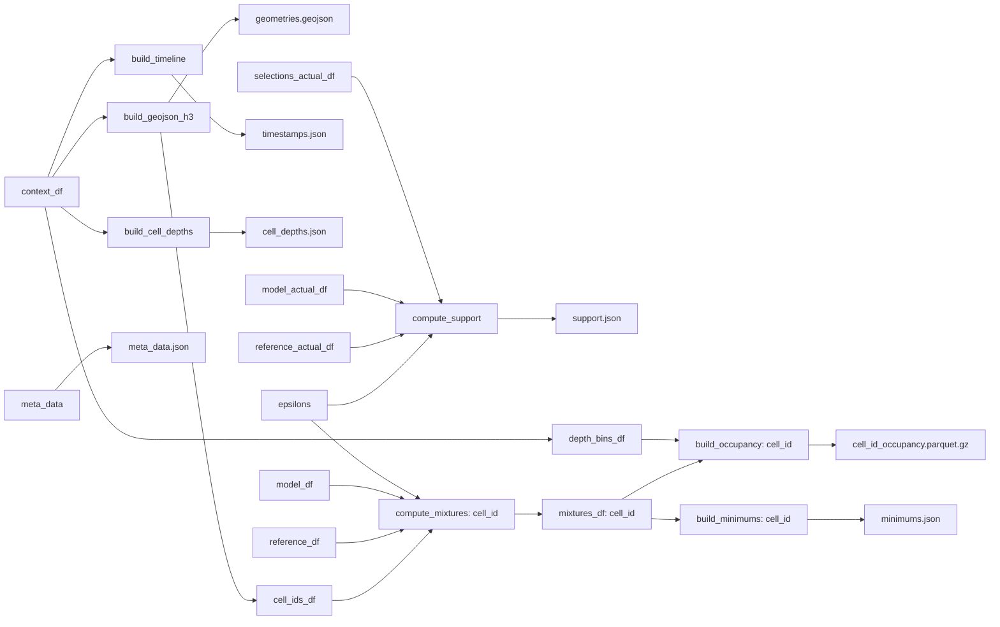

## Context
For more context see: 
- The theory: `../Common/Bayesian Model Interpolation.md`
- The schemas: `../../../Backend/API/Depth/Data.md`

## `build_report`
`fishflow/depth/report.py`

```python
build_report(
	meta_data,
	model_df, 
	reference_model_df,
	context_df,
	model_actuals_df,
	reference_model_actuals_df,
	selections_actuals_df,
	epsilons,
	data_dir
)
```
#### Inputs
- `meta_data` - the metadata for this scenario (see `../../../Backend/API/Depth/Data.md:MetaDataSchema)
- `model_df` - inference of our model over the space and time of interest (`_decision`, `_choice`, `probability`) (mixtures are built from this)
- `reference_model_df` - inference of our model over the space and time of interest (`_decision`, `_choice`, `probability`) (mixtures are built from this)
- `context_df` - the context associated with our choices `_decision`, `_choice`, `datetime`, `h3_index`, `depth_bin`
- `model_actuals_df` - inference of our model over the space and time we want to derive our support from (`_decision`, `_choice`, `probability`) 
- `reference_model_actuals_df` - inference of our model over the space and time we want to derive our support from (`_decision`, `_choice`, `probability`)
- `selections_actuals_df` -  the `_decision`, `_choice` pairs actually observed (one choice per decision here)
- `epsilons` - an array from 0 to 1 indicating the mixture family density we want
- `data_dir` - the directory to build our `{scenario_id}` directory in and place the following files:
#### Outputs
```bash
+-- {scenario_id}
|   | 
|   +-- meta_data.json
|   +-- geometries.geojson
|   +-- cell_depths.json
|   +-- minimums.json
|   +-- timestamps.json
|   +-- {cell_id}_occupancy.parquet.gz
```

(documented in `../../../Backend/API/Depth/Data.md`)
#### Notes
The purpose of the `build_report` is to fill out the following schema (documented in `../../../Backend/API/Depth/Data.md`): 

```bash
+-- {scenario_id}
|   | 
|   +-- meta_data.json
|   +-- geometries.geojson
|   +-- cell_depths.json
|   +-- minimums.json
|   +-- timestamps.json
|   +-- {cell_id}_occupancy.parquet.gz
```

for the inference of a model mixture of two depth models over a specific time and place. For more on what a model mixture is see `../Common/Bayesian Model Interpolation.md`

Building a mixture is a bit of a web... 


Note that `depth_bins_df` is just the context df's `_decision`, `_choice`, and `depth_bin` columns. 

Given there's going to be a _ton_ of data here we want to build mixtures one cell at a time. That is build each occupancy file one at a time in a loop. 

##### File Writing
This function should create a new directory for the `{scenario_id}`. If the directory already exists overwrite it. 

We should end up with as many occupancy parquet files as there are `cell_id`'s

##### Data Checks
`model_df` and `reference_model_df` should have precisely the same `_decision`, `_choice` pairs. 

Separately, `model_actuals_df` and `reference_model_actuals_df` should have the same `_decision` and `_choice` pairs and `selections_actuals_df` should have the same set of `_decision` values with each `_choice` being matched to a choice in `model_actuals_df` (however not all choices will be present as this is the actual selected choices, not all choices available per decision)

##### Checks
We need to ensure that we check that the following are in the meta_data passed to the function:

- scenario_id: str
- name: str
- species: str
- model: str
- reference model: str
- region: str
- reference_region: str
- description: str
- reference_time_window: \[datetime, datetime]
- zoom: integer (zoom for a map)
- center: (lon, lat) (center for a map)

These (and only these) should be provided in the example in the README.md

The following should be derived from the data provided
- resolution: int (h3 resolution)
- grid_size: int (number of h3 cells in the geojson)
- depth_bins: \[float, float, ..., float] (derived from the context)
- support: \[float, float, ..., float] (derived from `compute_support`)
- time_window: \[datetime, datetime] (from `context_df`)

The function to use to get the `h3` resolution is `get_resolution` not `h3_get_resolution`.
#### Dependencies

- `../Common/Support.md:compute_support`
- `../Common/Support.md:compute_mixtures`
- `../Common/Spacetime.md:build_geojson_h3`
- `../Common/Spacetime.md:build_timeline`
- `build_minimums`
- `build_occupancy`
- `build_cell_depths`

## `build_minimums`
`fishflow/depth/report.py`

```python
build_minimums(mixture_df, minimums={}) --> minimums
```
#### Inputs
- `mixture_df` - `cell_id`, `depth_bin`, `datetime`, `probability`, `epsilon`
- `minimums` - `minimums` to add to: `{cell_id(int) -> {depth_bin -> {month(int) -> minimums_array}}}` where `minimums_array` is the minimum depth occupancy in that cell and month per hour `0-23`. It is an array of length 24 containing floats.
#### Outputs
- an updated `minimums`
#### Notes
Creates a minimums map as documented in `../../Backend/API/Depth/Data.md:MinimumsSchema`

We need to break the timestamp into a month of the year (0-12) and hour of the day (0-23). Second we need to filter to `epsilon=1` (the non-reference model). Then we bin by `cell_id`, `depth_bin`, month of the year, hour of the day, and take the minimum over `probability` per bin. 

## `build_occupancy`
`fishflow/depth/report.py`

```python
build_occupancy(mixture_df) --> occupancy_df
```
#### Inputs
- **@input** `mixture_df` - a mixture `pd.DataFrame` for a single `cell_id` with at least the columns `depth_bin`, `datetime`, `probability`, `epsilon` 
#### Outputs
- **@returns** `occupancy_df` - a `pd.DataFrame` where the columns represent combinations of depth bin and mixture model (captured by `epsilon`), the rows are the `datetime` in order (earliest at top), and the values are the corresponding `probability`'s

For the columns we have `model_idx=col // num_depth_bins` and `depth_bin_idx=col % num_depth_bins`. `model_idx` is the index in the sorted `epsilon` array built of the unique `epsilon`'s in `mixture_df`.

#### Notes
Builds an occupancy dataframe for a specific `cell_id`

For more context see `../../Backend/API/Depth/Data.md:OccupancySchema`

## `build_cell_depths`
`fishflow/depth/report.py`

```python
build_cell_depths(context_df) --> cell_depths
```
#### Inputs
- `context_df` - a `pd.DataFrame` with at least `cell_id`, `depth_bin`
#### Outputs
- `cell_depths` - `{cell_id: max(cell_depth)}`
#### Notes
Gets the deepest depth bin per `cell_id`


